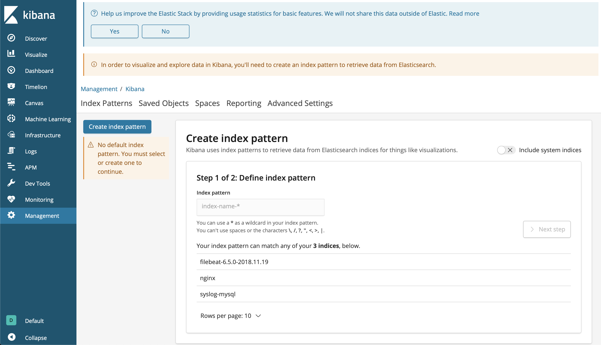

# Elasticsearch demo

**This is a sample repo showing how to ship logs with Logstash and Filebeat to Elasticsearch and then visualise with Kibana**

# Prerequirements: 
1. You need to have Vagrant installed and have some basic knowledge working with.
2. At least 8GB RAM

# Vagrantfile
We are creating 3 Virtual machines named `elastic`, `nginx` and `mysql`

Elasitc VM contains: Kibana software, Elasticsearch software and Filebeat software - *We are using filebeat to monitor all logs on the system and send them to Elasticsearch software*

Nginx VM contains: Nginx server and Logstash software - *We are using Logstash to ship nginx server logs to Elasticsearch software*

Mysql VM contains: Mysql server and Logstash software - *Currently database server is not actively working, but Logstash is set to monitor the syslog where database events are stored and ship them to Elastic search*

After all logs are shiped to Elasticsearch and indexed, we are using Kibana to visualise them.    
Servers are connected like shown on below grahp:

# Provisioning
All 3 VMs are provisioned with the 3 scripts (one for each VM) placed inside the `scriprs` folder.
Using them all needed software is installed, some configurations files (stored in `conf` folder) are replaced in order to configure the software.

# How to use:
1. Fork this repo, clone it and navigate to the folder
2. Do `vagrant up` and wait until provisioning is over
3. System logs from Elastic and Mysql VMs are already created and shiped to Elasticsearch so now you need to create some Nginx
   Nginx server's port is forwared on localhost:8080 so you need to do some connections from your browser.
   For example:      
   Do 5 `localhost:8080` that will generate 5 reposnse codes 200.    
   Do 2 `localhost:8080/something` that will generate 2 response codes 404.
4. Now you can open Kibana located on localhost:5601
   At fist you will be asked to create index patterns based on the indicies that Kibana has received from Elasticsearch
   Below you can see that there is indices for mysql,nginx and the system logs from Filebeat
   Index pattern should match part of the name seen below
   
   
   
5. Now you can go to `Visualize` and create some Visualizatons, for example:
   Create a Pie chart to check what is the count of response codes for your Ngninx server.

6. Save your visualizations and go to Dashboard - create new and import your saved visualization into the Dashboard.
   Now you can make some connections toward your nginx server and watch in almost real time how graphs are changing, depending on your refresh interval.
   
   
   
   
